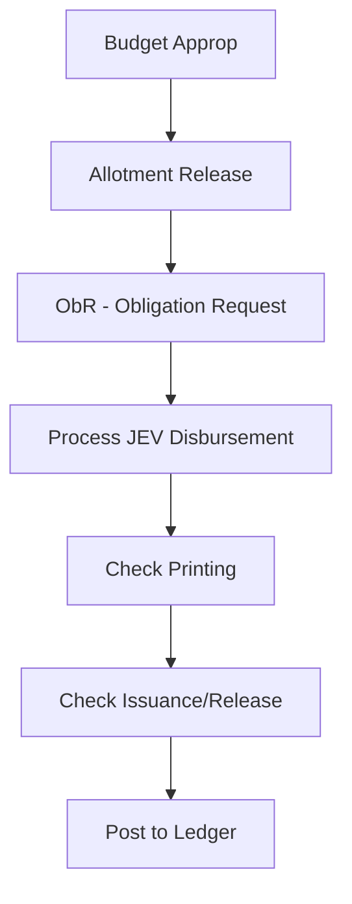
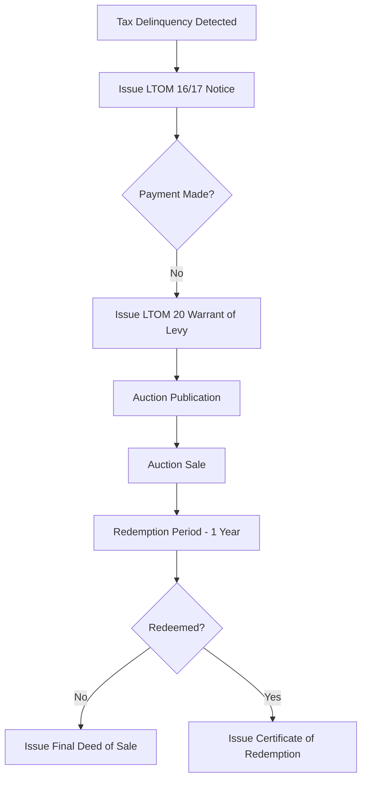

# Local Financial System (LFS) - Comprehensive Feature Documentation

## 1. Project Overview
The **Local Financial System (LFS)** is an enterprise-grade ERP solution designed specifically for Local Government Units (LGUs). It provides a unified platform for managing the entire financial lifecycle, from budget appropriation and tax assessment to cash collection, disbursements, and final financial reporting.

### Key Pillars of the System:
*   **Fiscal Discipline**: Strict enforcement of budgetary controls and obligation tracking.
*   **Revenue Optimization**: Advanced Real Property Tax (RPT) and Business Tax management with automated penalty/discount logic.
*   **Transparency & Compliance**: Full double-entry accounting with audit trails and COA-compliant reporting (aligned with the Philippine New Government Accounting System - NGAS).
*   **Operational Efficiency**: Automated synchronization of data and streamlined workflows for treasury and registry operations.

---

## 2. Core Functional Modules

### 2.1. Budgeting & Allotment
Ensures that all LGU spending is authorized and funded.
*   **Appropriations Management**: Tracks Annual and Supplemental Budgets.
*   **Allotment Release**: Manages the release of funds to specific departments or projects.
*   **Obligation Requests (ObR)**: Preregistration of expenses against specific budget lines (PS, MOOE, CO).
*   **Augmentations & Realignments**: Facilities for shifting funds between budget items within legal limits.
*   **Budget Monitoring**: Real-time tracking of Appropriation vs. Allotment vs. Obligation.

### 2.2. Advanced Accounting (JEV System)
A robust accounting engine that supports complex government bookkeeping.
*   **Journal Entry Voucher (JEV)**: The primary entry point for all financial data. Supports 6+ specialized journals (General, Cash Receipts, Cash/Check Disbursements, etc.).
*   **Chart of Accounts (COA) Management**: Full control over General Ledger and Subsidiary Ledger account structures.
*   **Beginning Balances**: Seamless carry-over of balances from previous fiscal years.
*   **Automatic Financial Statements**: Real-time generation of Balance Sheets, Income Statements, and Trial Balances.

### 2.3. Real Property Tax (RPT) Lifecycle
The most comprehensive module, managing properties from assessment to potential auction.
*   **Property Assessment**: Management of Real Property Units (RPUs) and Assessment Roll Property (ARP) numbers.
*   **Tax Billing**: Intelligent calculation of Basic and SEF taxes with automated prompt/advance discounts.
*   **Delinquency Management**:
    *   **Automatic Penalty Calculation**: 2% monthly penalty for late payments.
    *   **Delinquency Notices**: Automated generation of statutory notification letters (LTOM Series).
    *   **Warrant of Levy**: Legal document generation for seizing properties due to long-term delinquency.
*   **RPT Auctions & Biddings**:
    *   **Auction Scheduling**: Categorizing and listing properties for public auction.
    *   **Bidding System**: Managing bidders and recording winning bids for delinquent properties.
    *   **Redemption & Final Deeds**: Managing the 1-year redemption period and final transfer of ownership.

### 2.4. Treasury & Specialized Collections
*   **Official Receipts (OR)**: Support for multiple accountable forms (AF 51, AF 56, etc.).
*   **Cash Ticket System**: Management and issuance of fixed-value tickets for markets or stalls.
*   **Community Tax Certificate (Cedula)**: Dynamic calculation based on individual or corporate income.
*   **Business Tax & Fees**: Configurable business categories and add-on charges for local licensing.
*   **Bank Management**: Detailed tracking of Bank Accounts, Deposits, and formal Bank Statements reconciliation.

---

## 3. Detailed Reporting System
The system features an extensive reporting engine generating over 60+ statutory and management reports.

### 3.1. Financial Statements (NGAS Compliant)
*   **Statement of Financial Position**: Consolidated assets, liabilities, and equity.
*   **Statement of Financial Performance**: Detailed revenue and expenditure breakdown.
*   **Statement of Cash Flows**: Direct method tracking of operating, investing, and financing activities.
*   **Statement of Changes in Net Assets/Equity**: Tracking movements in government equity.
*   **Trial Balances**: Support for both Pre-Trial and Post-Trial balance reports.

### 3.2. Books of Accounts & Journals
*   **General Ledger**: Central record for all accounts.
*   **Subsidiary Ledger**: Detailed breakdown for specific entities, employees, or projects.
*   **Cash Receipts Journal (CRJ)**: Chronological record of all collections.
*   **Cash Disbursements Journal (CDJ)**: Record of all cash payments.
*   **Check Disbursements Journal (CkDJ)**: Record of all check-based payments.
*   **General Journal**: Record of non-cash adjustments and closing entries.
*   **Procurements Received Journal**: Tracking of goods and services formally received.

### 3.3. Treasury & Cashiering Reports
*   **Report of Collections and Deposits (RCD)**: Daily summary of receipts and bank deposits.
*   **Cashbook**: Daily record of cash on hand balances.
*   **Daily Cash Position Report**: Management report for monitoring available liquid funds.
*   **Consolidated Receipts**: Summary of collections across multiple funds.
*   **Schedule of Released/Unreleased Checks**: Monitoring of disbursement activity.
*   **Check Issued Report**: Detail of all checks printed and distributed.

### 3.4. RPT Legal & Statutory Documents (LTOM Series)
Highly specialized documents for tax enforcement (Local Treasury Operations Manual compliant):
*   **LTOM 16**: Notice of Delinquency in the Payment of Real Property Tax.
*   **LTOM 17-19**: Sequential Notices of Delinquency for persistent cases.
*   **LTOM 20**: Warrant of Levy.
*   **LTOM 21**: Notice of Levy.
*   **LTOM 22**: Report of Levy.
*   **LTOM 23-24**: Notice of Publication and Auction Sale.
*   **LTOM 25**: Public Auction Registration Form.
*   **LTOM 26**: List of Registered Bidders.
*   **LTOM 29**: Certificate of Sale.
*   **LTOM 30**: Declaration of Forfeiture.
*   **LTOM 32**: Certificate of Redemption.
*   **LTOM 34**: Final Deed of Sale.

### 3.5. Budget Monitoring Reports
*   **SAAOB (Statement of Appropriation, Allotment, and Obligation)**: Comprehensive status of LGU spending capability.
*   **SAAO**: High-level summary of budget status.

### 3.6. Accountable Forms & Certifications
*   **AF 51 / AF 56 / AF 58**: Official government receipts for general and tax collections.
*   **Real Property Tax Due Bill**: Formal billing statement for property owners.
*   **Certificate of Tax Clearance**: Official document certifying no outstanding tax liabilities.
*   **Abstract of General Collection**: Periodic summary of all types of income collected.

---

## 4. Key Workflows

### 4.1. JEV Disbursement Workflow

### 4.2. RPT Enforcement Workflow

---

## 5. Technical Computations

### 5.1. Real Property Tax (RPT)
*   **Basic Tax**: $$ AV \times 1\% $$
*   **SEF Tax**: $$ AV \times 1\% $$
*   **Prompt Discount**: 10% (if paid within the quarter).
*   **Advance Discount**: 20% (if paid for the next year).
*   **Delinquency Penalty**: 2% per month (max 72% / 36 months).

---

## 6. System Governance
*   **Database Synchronization**: Keeps local assessment data in sync with the central LFS database.
*   **Role-Based Access Control**: Ensures only authorized personnel can approve JEVs or post payments.
*   **Audit Trail**: Logs all critical transactions and modifications for accountability.
