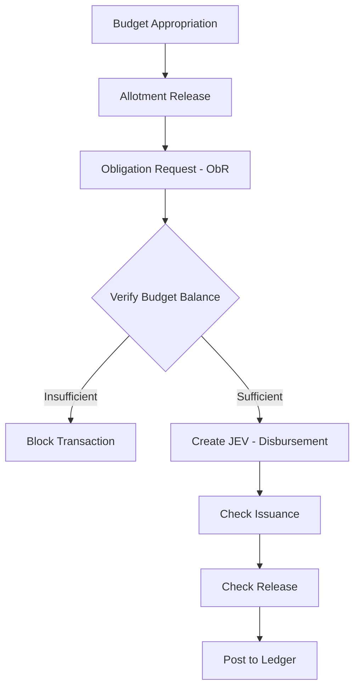
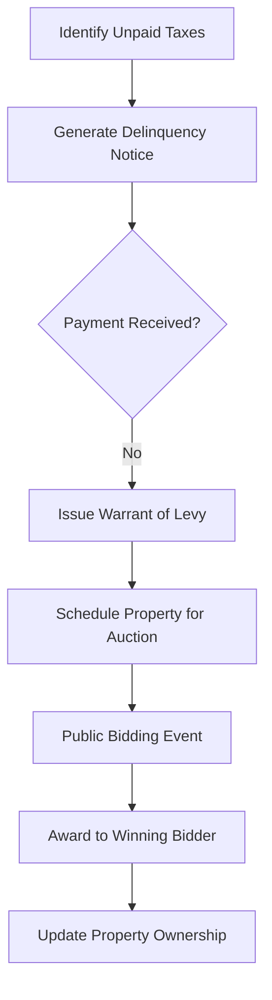

# Local Financial System (LFS) - Comprehensive Feature Documentation

## 1. Project Overview
The **Local Financial System (LFS)** is an enterprise-grade ERP solution designed specifically for Local Government Units (LGUs). It provides a unified platform for managing the entire financial lifecycle, from budget appropriation and tax assessment to cash collection, disbursements, and final financial reporting.

### Key Pillars of the System:
*   **Fiscal Discipline**: Strict enforcement of budgetary controls and obligation tracking.
*   **Revenue Optimization**: Advanced Real Property Tax (RPT) and Business Tax management with automated penalty/discount logic.
*   **Transparency & Compliance**: Full double-entry accounting with audit trails and COA-compliant reporting.
*   **Operational Efficiency**: Automated synchronization of data and streamlined workflows for treasury and registry operations.

---

## 2. Core Functional Modules

### 2.1. Budgeting & Allotment
Ensures that all LGU spending is authorized and funded.
*   **Appropriations Management**: Tracks Annual and Supplemental Budgets.
*   **Allotment Release**: Manages the release of funds to specific departments or projects.
*   **Obligation Requests (ObR)**: Preregistration of expenses against specific budget lines (PS, MOOE, CO).
*   **Augmentations & Realignments**: Facilities for shifting funds between budget items within legal limits.

### 2.2. Advanced Accounting (JEV System)
A robust accounting engine that supports complex government bookkeeping.
*   **Journal Entry Voucher (JEV)**: The primary entry point for all financial data. Supports 6+ specialized journals (General, Cash Receipts, Cash/Check Disbursements, etc.).
*   **Chart of Accounts (COA) Management**: Full control over General Ledger and Subsidiary Ledger account structures.
*   **Beginning Balances**: Seamless carry-over of balances from previous fiscal years.
*   **Automatic Financial Statements**: Real-time generation of Balance Sheets, Income Statements, and Trial Balances.

### 2.3. Real Property Tax (RPT) Lifecycle
The most comprehensive module, managing properties from assessment to potential auction.
*   **Property Assessment**: Management of Real Property Units (RPUs) and Assessment Roll Property (ARP) numbers.
*   **Tax Billing**: Intelligent calculation of Basic and SEF taxes with automated prompt/advance discounts.
*   **Delinquency Management**:
    *   **Automatic Penalty Calculation**: 2% monthly penalty for late payments.
    *   **Delinquency Notices**: Automated generation of notification letters to delinquent taxpayers.
    *   **Warrant of Levy**: Legal document generation for seizing properties due to long-term delinquency.
*   **RPT Auctions & Biddings**:
    *   **Auction Scheduling**: Categorizing and listing properties for public auction.
    *   **Bidding System**: Managing bidders and recording winning bids for delinquent properties.

### 2.4. Treasury & Specialized Collections
*   **Official Receipts (OR)**: Support for multiple accountable forms (AF 51, AF 56, etc.).
*   **Cash Ticket System**: Management and issuance of fixed-value tickets for markets or stalls.
*   **Community Tax Certificate (Cedula)**: Dynamic calculation based on individual or corporate income.
*   **Business Tax & Fees**: Configurable business categories and add-on charges for local licensing.
*   **Bank Management**: Detailed tracking of Bank Accounts, Deposits, and formal Bank Statements reconciliation.

### 2.5. Loans & Amortization
*   **Loan Tracking**: Recording of bank loans and amounts released to the LGU.
*   **Amortization Schedules**: Automated calculation of principal and interest repayments over the loan term.

---

## 3. High-Level Workflows

### 3.1. The Expenditure Workflow (Budget to Payment)

### 3.2. RPT Delinquency to Auction Workflow

---

## 4. Technical Computations & Rules

### 4.1. RPT Penalty & Discount Matrix
| State | Trigger | Calculation |
| :--- | :--- | :--- |
| **Advance** | Paid before Jan 1 | `Tax * 20% Discount` |
| **Prompt** | Paid within Quarter | `Tax * 10% Discount` |
| **Delinquent** | Paid after Quarter | `Tax * (2% * Months Delayed)` |

### 4.2. Community Tax (Cedula) Formula
$$ \text{Total Tax} = \text{Basic Fee} + \left( \frac{\text{Business Gross} + \text{Salaries} + \text{Property Income}}{1000} \right) $$
*Note: The "Additional Tax" component is capped at a maximum of 5,000 PHP.*

### 4.3. Amortization Logic
The system generates schedules based on:
1.  **Principal Amount**: The total loan released.
2.  **Annual Interest Rate**: Distributed across monthly or quarterly payments.
3.  **Term**: Total duration (e.g., 5 years, 10 years).

---

## 5. Administrative & Governance Features
*   **Database Synchronization**: A specialized tool to sync local RPT assessment data with the main LFS database, ensuring assessors and collectors work on consistent data.
*   **Role-Based Access Control (RBAC)**: Fine-grained permissions (e.g., `TransJEVApproval`, `RptPaymentPost`) to ensure segregation of duties.
*   **Signatories Management**: Centralized management of authorized officials for automated report signing.
*   **Audit Logging**: Internal tracking of who created or updated specific financial records.

---

## 6. Official Government Reports (RDLC)
| Module | Key Reports |
| :--- | :--- |
| **Budget** | Statement of Appropriation, Allotments, and Obligations (SAAOB) |
| **Accounting** | General Ledger, Trial Balance, Balance Sheet, Income Statement |
| **Treasury** | Report of Collections and Deposits (RCD), Cash Book, Check Issued Journal |
| **RPT** | Certified List of Delinquencies, Notice of Delinquency, Warrant of Levy, Auction List |
| **Civil Registry** | Marriage License, Burial Permit, Cattle Ownership Certificate |
