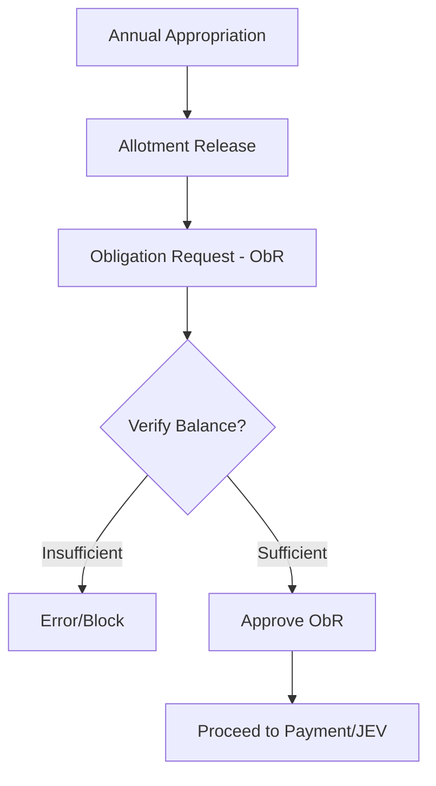
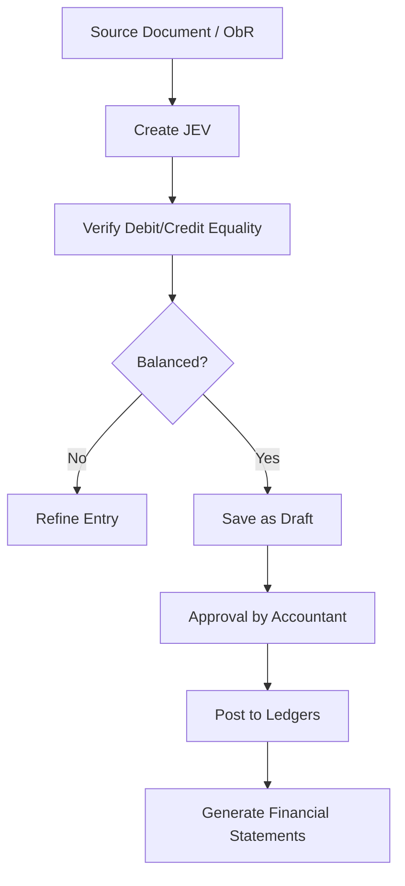
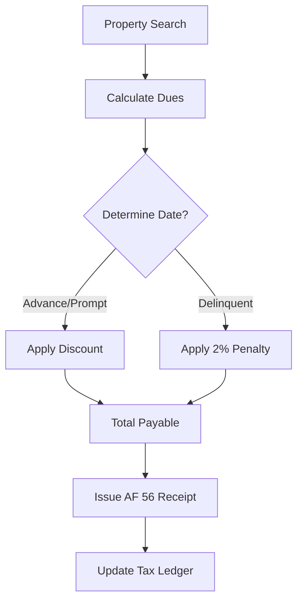

# Local Financial System (LFS)

## 1. Project Overview
The **Local Financial System (LFS)** is an enterprise-grade ERP solution tailored for Local Government Units (LGUs). It provides a unified platform for managing the entire financial lifecycle, from budget appropriation and tax assessment to cash collection, disbursements, and final financial reporting.

### Key Pillars of the System:
*   **Fiscal Discipline**: Strict enforcement of budgetary controls and obligation tracking.
*   **Revenue Optimization**: Advanced Real Property Tax (RPT) and Business Tax management with automated penalty/discount logic.
*   **Transparency & Compliance**: Full double-entry accounting with audit trails and COA-compliant reporting (aligned with the Philippine New Government Accounting System - NGAS).
*   **Operational Efficiency**: Automated synchronization of data and streamlined workflows for treasury and registry operations.

---

## 2. Budgeting Module
The Budgeting Module ensures that all LGU spending is authorized, funded, and tracked against the approved budget. It implements strict fiscal controls to prevent over-obligation and ensures compliance with government budgeting rules.

### 2.1. Core Features
*   **Allotment Classes**: Categorization of budget items into Personal Services (PS), Maintenance and Other Operating Expenses (MOOE), and Capital Outlay (CO).
*   **Function/Program/Project (FPP)**: Mapping of budget lines to specific government functions or infrastructure projects.
*   **Fund Management**: Support for General Fund, Special Education Fund (SEF), and Trust Funds.
*   **Appropriations**: Recording of Annual and Supplemental Budgets, as well as Realignments & Augmentations (legal transfer of funds).
*   **Expenditure Control**: Allotment Release and Obligation Request (ObR) processing with automated balance verification.

### 2.2. Budget Workflow

### 2.3. Key Reports
| Report | Description |
| :--- | :--- |
| **SAAOB** | Statement of Appropriation, Allotment, and Obligation. |
| **SAAO** | Statement of Appropriation, Allotment. |
| **Status of Appropriations** | Detailed breakdown of spending per FPP. |

---

## 3. Accounting Module
The Accounting Module is a full-featured, NGAS-compliant double-entry system. It manages the LGU's books of accounts, ensures every transaction is balanced, and generates all required financial statements.

### 3.1. Core Features
*   **Journal Entry Voucher (JEV)**: Unified entry point for General, Cash Receipts, Cash Disbursements, Check Disbursements, Procurement Received, and ADA journals.
*   **Ledger Management**: General Ledger (GL) for high-level balances and Subsidiary Ledger (SL) for detailed tracking of entities/projects.
*   **NGAS Compliance**: Chart of Accounts (COA) structure following the New Government Accounting System.
*   **Financial Configuration**: Tools for Beginning Balances, Account Grouping, and Transaction Audit Logs.

### 3.2. Accounting Cycle Workflow

### 3.3. NGAS Compliant Reports
| Report Type | Specific Reports |
| :--- | :--- |
| **Financial Statements** | Statement of Financial Position, Performance, Cash Flows, Net Assets/Equity. |
| **Trial Balances** | Pre-Closing and Post-Closing Trial Balances. |
| **Journals & Ledgers** | Specialized reports for each Journal and Ledger type. |

---

## 4. Treasury & RPT Module
The Treasury Module manages revenue collection, cash custody, and disbursements. A major component is the **Real Property Tax (RPT)** system for assessment, billing, and enforcement.

### 4.1. Core Features
*   **Revenue & Collections**: Support for AF 51 (General), AF 56 (RPT), Cedula (Community Tax), and Cash Tickets.
*   **RPT Specialized Logic**: Automated computation of Basic Tax (1%), SEF (1%), Prompt/Advance Discounts, and 2% monthly Penalties.
*   **RPT Enforcement**: Automated LTOM 16-34 notices, Warrant of Levy (LTOM 20), Public Auction management, and Redemption tracking.
*   **Cash & Bank**: Management of bank accounts, deposits, and automated check issuance.

### 4.2. RPT Collection Workflow

### 4.3. Statutory Reports
| Category | Key Reports / Documents |
| :--- | :--- |
| **Collections** | Report of Collections & Deposits (RCD), Cash Book, Abstract of Collections. |
| **RPT Enforcement** | LTOM Series (Notice of Delinquency, Warrant of Levy, Certificate of Sale). |
| **Registry** | Marriage License, Burial Permit, Cattle Ownership Certificate. |

---

## 5. Cross-Module & Administrative Features
*   **Database Synchronization**: Syncs assessment data from local assessors to the central LFS database.
*   **Role-Based Access Control**: Ensures strict segregation of duties (e.g., separate roles for JEV entry and approval).
*   **Audit Trail**: Logs all critical modifications to financial records for accountability.
*   **NgAS & LTOM Compliance**: All reports and workflows are formatted to meet Philippine statutory requirements.
