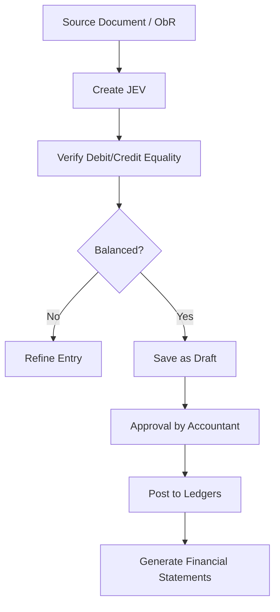

# LFS - Accounting Module Documentation

## 1. Overview
The Accounting Module is a full-featured, NGAS-compliant double-entry system. It manages the LGU's books of accounts, ensures every transaction is balanced, and generates all required financial statements for oversight agencies like COA.

## 2. Core Features

### 2.1. Journal Entry Voucher (JEV) System
The JEV is the unified entry point for all accounting records. 
*   **Journal Types**:
    *   **General Journal**: Adjustments, closing entries, non-cash transactions.
    *   **Cash Receipts Journal**: Record of all collections deposited.
    *   **Cash Disbursements Journal**: Record of cash payments.
    *   **Check Disbursements Journal**: Record of check payments.
    *   **Procurement Received Journal**: Assets and inventory recognition.
    *   **ADA Disbursements**: Authority to Debit Account transactions.
*   **Validation**: Real-time checking to ensure `Total Debits == Total Credits`.

### 2.2. Ledger Management
*   **General Ledger (GL)**: High-level account balances.
*   **Subsidiary Ledger (SL)**: Detailed tracking for specific entities (employees, suppliers, projects).
*   **Chart of Accounts (COA)**: Customizable account structure following the New Government Accounting System (NGAS).

### 2.3. Financial Configuration
*   **Beginning Balances**: Tool for migrating balances from the previous fiscal year.
*   **Accounts Grouping**: Managing Major and Sub-Major account groups.
*   **Transaction Logs**: Audit trail for every debit and credit entry.

## 3. Workflows

### 3.1. The Accounting Cycle

## 4. NGAS Compliant Reports
| Report Type | Specific Reports |
| :--- | :--- |
| **Financial Statements** | Statement of Financial Position, Performance, Cash Flows, Net Assets/Equity. |
| **Trial Balances** | Pre-Closing Trial Balance, Post-Closing Trial Balance. |
| **Journals** | Specialized reports for each Journal type (CRJ, CDJ, CkDJ, etc.). |
| **Ledgers** | General Ledger, Subsidiary Ledger, Summary of SL. |
