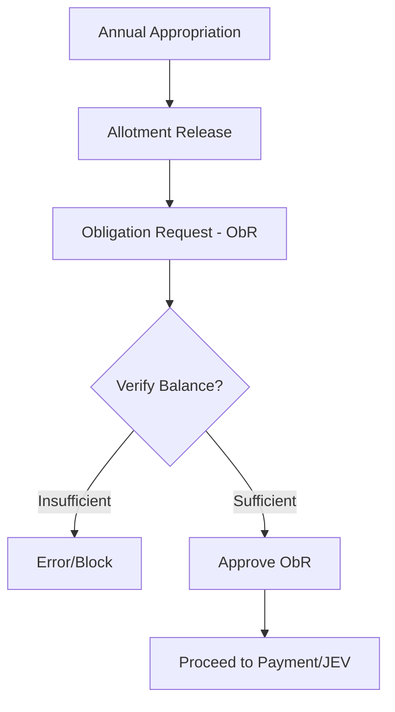

# LFS - Budgeting Module Documentation

## 1. Overview
The Budgeting Module ensures that all LGU spending is authorized, funded, and tracked against the approved budget. It implements strict fiscal controls to prevent over-obligation and ensures compliance with government budgeting rules.

## 2. Core Features

### 2.1. Budget Setup & Management
*   **Allotment Classes**: Categorization of budget items into Personal Services (PS), Maintenance and Other Operating Expenses (MOOE), and Capital Outlay (CO).
*   **Function/Program/Project (FPP)**: Mapping of budget lines to specific government functions or infrastructure projects.
*   **Fund Management**: Support for General Fund, Special Education Fund (SEF), and Trust Funds.

### 2.2. Appropriations
*   **Annual Budget**: Recording the initial approved budget at the start of the fiscal year.
*   **Supplemental Budget**: Recording additional appropriations approved throughout the year.
*   **Realignments & Augmentations**: Legal transfer of funds from one budget line to another within the same allotment class.

### 2.3. Expenditure Control
*   **Allotment Release**: The process of making appropriated funds available for use by departments.
*   **Obligation Request (ObR)**: Preregistration of an expense. The system validates the `Appropriation Balance` before allowing an ObR to be saved.
*   **Obligation Monitoring**: Real-time tracking of how much of the allotment has been "obligated" (committed) and how much remains.

## 3. Workflows

### 3.1. Budget Lifecycle

## 4. Key Reports
| Report | Description |
| :--- | :--- |
| **SAAOB** | **Statement of Appropriation, Allotment, and Obligation**. The primary report showing budget vs. actual utilization. |
| **SAAO** | **Statement of Appropriation, Allotment**. High-level summary of fund availability. |
| **Status of Appropriations** | Detailed breakdown of spending per FPP. |
