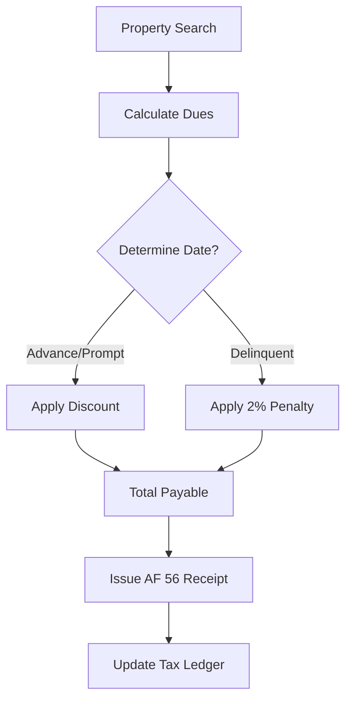

# LFS - Treasury & RPT Module Documentation

## 1. Overview
The Treasury Module manages the LGU's revenue collection, cash custody, and disbursements. A major component of this module is the **Real Property Tax (RPT)** system, which handles property assessment, billing, and enforcement.

## 2. Core Features

### 2.1. Revenue & Collections
*   **Official Receipts**: Support for Accountable Forms (AF 51 - General, AF 56 - RPT).
*   **Community Tax Certificate (Cedula)**: Automated tax calculation for Individuals and Corporations based on income.
*   **Business Tax & Fees**: Configurable rates for local licensing and fees.
*   **Cash Tickets**: Fixed-value tickets for market/stall collections.

### 2.2. Real Property Tax (RPT) Specialized Logic
*   **Assessment Rolls (ARP)**: Tracking of property values, kind (Land, Building, Machinery), and actual use.
*   **Tax Billing**: Automated computation using:
    *   **Basic Tax (1%)** and **Special Education Fund (1%)**.
    *   **Prompt/Advance Discounts**: 10% to 20% savings for early payers.
    *   **Delinquency Penalty**: 2% monthly interest for late payments.

### 2.3. RPT Enforcement (LTOM Compliant)
*   **Delinquency Notices**: Automated generation of LTOM 16-19 statutory notices.
*   **Warrant of Levy**: Legal seizure of property for non-payment (LTOM 20).
*   **Public Auction**: Managing the bidding and sale process for delinquent properties.
*   **Redemption**: Managing the 1-year window for owners to reclaim seized property.

### 2.4. Cash & Bank Management
*   **Bank Records**: Tracking of multiple bank accounts and reconciliation.
*   **Deposits**: Linkage between collections and formal bank deposits.
*   **Check Issuance**: Printing and monitoring of disbursement checks.

## 3. Workflows

### 3.1. RPT Collection Workflow

## 4. Statutory Reports (Treasury & LTOM)
| Category | Key Reports / Documents |
| :--- | :--- |
| **Collections** | Report of Collections & Deposits (RCD), Cash Book, Abstract of Collections. |
| **Disbursements** | Schedule of Released/Unreleased Checks, Check Issued Journal. |
| **RPT Enforcement** | LTOM 16-34 (Notice of Delinquency, Warrant of Levy, Certificate of Sale). |
| **Registry** | Marriage License, Burial Permit, Cattle Ownership Certificate. |
